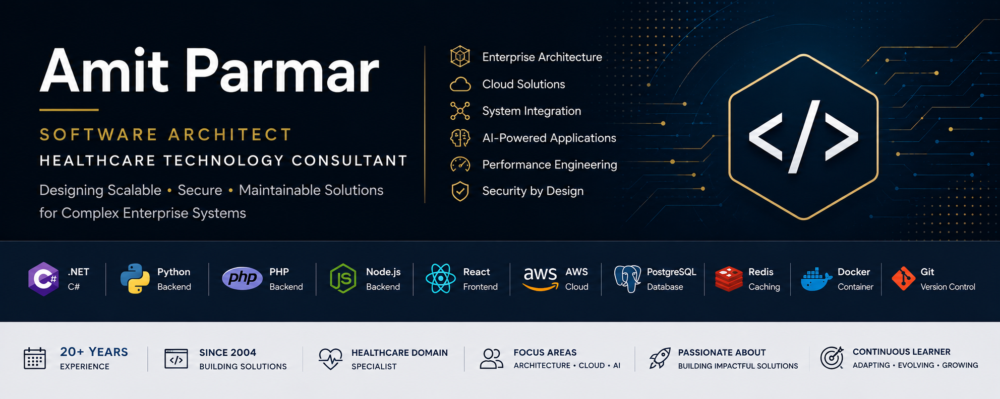

  

# Hi 👋 I'm Amit Parmar

### Senior Software Engineer • Enterprise Solution Designer

Building scalable enterprise applications for over **20 years** with expertise in backend development, cloud technologies, system integration, and software architecture.

---

## 🚀 Core Expertise

- Enterprise Application Development
- Solution Design & Architecture
- Healthcare Software
- Cloud-Native Applications
- Performance Optimization
- API & System Integration
- AI-enabled Solutions

---

## 💻 Primary Tech Stack

**Backend**

- .NET / ASP.NET Core
- C#
- Python
- Node.js
- PHP

**Frontend**

- React
- JavaScript
- TypeScript

**Cloud & DevOps**

- AWS
- Azure
- Docker
- Git

**Database**

- SQL Server
- PostgreSQL
- MySQL
- Redis

---

## 🌱 Currently Exploring

- AI Coding Agents
- Claude Code
- Ollama
- Hugging Face
- Enterprise AI Integration
- Modern Software Architecture

---

## 🎯 Engineering Philosophy

- Build maintainable software
- Design before coding
- Performance matters
- Keep solutions simple
- Never stop learning

---

## 📚 Featured Projects

🚧 Coming Soon

---

## 📝 Engineering Notes

🚧 Coming Soon

---

## 🤝 Let's Connect

- LinkedIn: https://www.linkedin.com/in/anparmar/